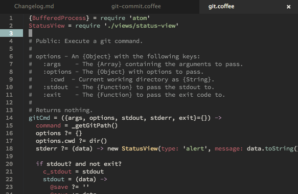

# dark-pastel-eighties-syntax theme

A fork of [dark-pastel](https://github.com/jenius/dark-pastel-atom-theme) that is a bit darker with my minor style preferences.

It goes well with the [spacegray-eighties-ui](https://atom.io/packages/spacegray-eighties-ui).
